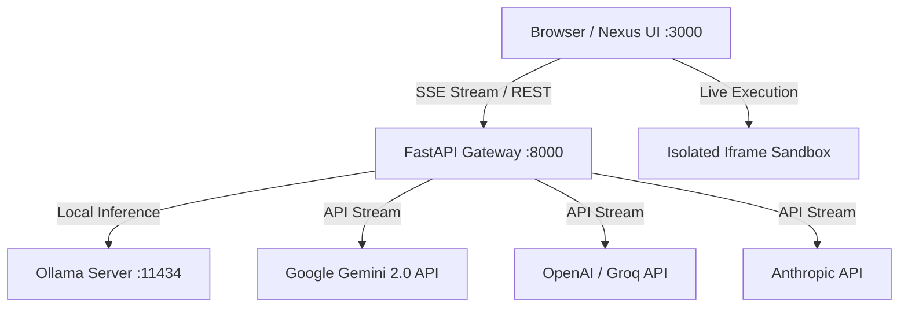

# ⚡ Nexus AI Studio

<div align="center">


**The ultra-lightweight, high-performance, open-source Self-Hosted AI Platform with Live Code Sandboxing, Multi-Provider Streaming, and zero setup complexity.**

[Türkçe Dokümantasyon](#-türkçe-özet--kurulum) • [Quickstart](#-quickstart-docker-compose) • [Features](#-key-features) • [Architecture](#-architecture) • [License](#-license)

</div>

---

## 🌟 Key Features

* 🚀 **1-Command Deployment:** Launch the entire studio in 5 seconds with `docker compose up -d`.
* 🔌 **Universal Multi-Provider Support:**
  * **Ollama:** Full support for local GPU/CPU models (`qwen2.5-coder`, `deepseek-r1`, `llama3`, etc.).
  * **Google Gemini:** Gemini 2.0 Flash / Pro (Google AI Studio key with 1M+ context).
  * **OpenAI & Anthropic:** GPT-4o, o3-mini, Claude 3.5 Sonnet.
  * **Groq:** Ultra-fast inference (300+ tok/s).
  * **Custom Endpoints:** Compatible with any OpenAI-compatible API bridge.
* ⚡ **Live Artifact Execution Sandbox:** Live preview, test, and interact with generated single-file HTML/JS/CSS applications, landing pages, and interactive widgets inside an isolated responsive sandbox (Desktop, Tablet, Mobile).
* 🧠 **DeepSeek-Style Reasoning Accordion:** Automatically parses and gracefully renders `<think>...</think>` thought chains in collapsible containers.
* 🎙️ **Voice Mode:** Integrated speech-to-text with real-time waveform input.
* 🌐 **Dual Language Engine:** Instant 1-click switch between **Turkish 🇹🇷** and **English 🇬🇧**.
* 🛡️ **Privacy First & Zero Telemetry:** Your API keys and chats reside locally in your browser/server.

---

## 🚀 Quickstart (Docker Compose)

### 1. Clone & Run
```bash
git clone https://github.com/OriginEdge/nexus-ai-studio.git
cd nexus-ai-studio

# Start Frontend (Port 3000) and Backend (Port 8000)
docker compose up -d
```

Open **`http://localhost:3000`** in your browser!

### 2. Optional: Run Local Ollama in Docker
```bash
docker compose --profile local-ai up -d
```

---

## 💻 Manual Setup (Development Mode)

### Backend
```bash
cd backend
python3 -m venv venv
source venv/bin/activate
pip install -r requirements.txt
uvicorn app.main:app --host 0.0.0.0 --port 8000 --reload
```

### Frontend
Open `frontend/src/index.html` directly in your browser or serve via any static HTTP server.

---

## 🏗️ Architecture



---

## 🇹🇷 Türkçe Özet & Kurulum

Nexus AI Studio; yerel **Ollama** modellerinizi ve **Google Gemini**, **OpenAI**, **Groq** gibi bulut zekalarını tek bir şık, karanlık temalı ve modern arayüzde birleştiren açık kaynaklı yapay zeka stüdyosudur.

* **Tek Komutla Kurulum:** `docker compose up -d`
* **Erişim:** `http://localhost:3000`
* **Canlı Kod Çalıştırma:** Modelin yazdığı web sitelerini tek tıkla canlı deneyin ve indirin.

---

## 📄 License
This project is open-source under the **[MIT License](LICENSE)**. Built by **Origin Edge**.
