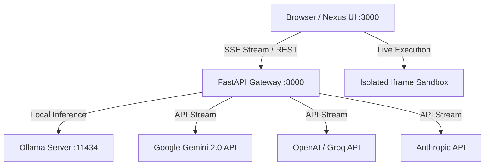

# ⚡ Nexus AI Studio

<div align="center">


**The modern, ultra-lightweight, open-source Self-Hosted AI Platform with Live Code Sandboxing, Multi-Provider Streaming, and zero setup complexity.**

---

[🇹🇷 Türkçe Dokümantasyona Git](#-türkçe-dokümantasyon) • [🇬🇧 Jump to English Documentation](#-english-documentation)

</div>

---

<a name="-english-documentation"></a>
# 🇬🇧 English Documentation

## 🌟 Key Features

* 🚀 **1-Command Deployment:** Launch the entire platform in seconds using `docker compose up -d`.
* 🔌 **Universal Multi-Provider Support:**
  * **Ollama (Local GPU/CPU):** Connect to local models (`qwen2.5-coder`, `deepseek-r1`, `llama3`, `mistral`, etc.).
  * **Google Gemini:** Full support for Gemini 2.0 Flash / Pro (Google AI Studio key with 1M+ context).
  * **OpenAI & Anthropic:** GPT-4o, o3-mini, Claude 3.5 Sonnet.
  * **Groq:** Ultra-fast inference at 300+ tokens/second.
  * **Custom Endpoints:** Connect to any OpenAI-compatible API reverse proxy.
* ⚡ **Live Artifact Execution Sandbox:** Live preview, test, and interact with generated single-file HTML/JS/CSS applications, landing pages, and interactive widgets inside an isolated responsive sandbox (Desktop, Tablet, Mobile).
* 🧠 **DeepSeek-Style Reasoning Accordion:** Automatically parses and gracefully renders `<think>...</think>` thought chains in collapsible containers.
* 🎙️ **Voice Mode:** Integrated speech-to-text with real-time waveform input.
* 🌐 **Dual Language Engine:** Instant 1-click switch between **Turkish 🇹🇷** and **English 🇬🇧**.
* 🛡️ **Privacy First & Zero Telemetry:** Your API keys and chats reside locally in your browser/server.

---

## 🚀 Quickstart (Docker Compose)

### 1. Clone & Run
```bash
git clone https://github.com/kefe3/nexus.git
cd nexus

# Start Frontend (Port 3000) and Backend (Port 8000)
docker compose up -d
```

Open **`http://localhost:3000`** in your browser!

### 2. Optional: Run Local Ollama with Docker
```bash
docker compose --profile local-ai up -d
```

---

## 💻 Manual Setup (Development Mode)

### 1. Backend Setup
```bash
cd backend
python3 -m venv venv
source venv/bin/activate
pip install -r requirements.txt
uvicorn app.main:app --host 0.0.0.0 --port 8000 --reload
```

### 2. Frontend Setup
Open `frontend/src/index.html` directly in your browser or serve via any static HTTP server.

---

## 🏗️ Architecture



---

<a name="-türkçe-dokümantasyon"></a>
# 🇹🇷 Türkçe Dokümantasyon

## 🌟 Öne Çıkan Özellikler

* 🚀 **Tek Komutla Kurulum:** `docker compose up -d` ile tüm sistemi 5 saniyede ayağa kaldırın.
* 🔌 **Sınırsız Çoklu Sağlayıcı (Multi-Provider):**
  * **Ollama (Yerel GPU/CPU):** Kendi ekran kartınızdaki yerel modeller (`qwen2.5-coder`, `deepseek-r1`, `llama3`, vb.).
  * **Google Gemini:** Gemini 2.0 Flash / Pro ve 1.5 Pro (Google AI Studio anahtarıyla 1M+ token context).
  * **OpenAI & Anthropic:** GPT-4o, o3-mini, Claude 3.5 Sonnet.
  * **Groq:** 300+ token/saniye hızında yıldırım hızında çıkarım.
  * **Özel Uç Noktalar:** Herhangi bir OpenAI-uyumlu API köprüsüne bağlanabilme.
* ⚡ **Canlı Artifact Sandbox (Kod Çalıştırıcı):** Yapay zekanın yazdığı web sitelerini, panelleri ve JavaScript uygulamalarını tarayıcı içinde anında canlı test edin, mobil/tablet/masaüstü boyutlarında inceleyin ve tek tıkla `.html` olarak indirin.
* 🧠 **Düşünce Süreci (DeepSeek Akordeonu):** Modelin `<think>...</think>` akıl yürütme adımlarını şık açılır-kapanır bloklarda düzenli gösterir.
* 🎙️ **Sesli Mod:** Gerçek zamanlı konuşarak yazdırma (Speech-to-Text).
* 🌐 **Çift Dil Desteği:** Tek tıkla anında **Türkçe 🇹🇷** ve **İngilizce 🇬🇧** arayüz.
* 🛡️ **Gizlilik Odaklı:** Sohbetleriniz ve API anahtarlarınız tamamen kendi cihazınızda saklanır, dışarıya sızdırılmaz.

---

## 🚀 Hızlı Başlangıç (Docker ile)

### 1. Depoyu İndirin ve Çalıştırın
```bash
git clone https://github.com/kefe3/nexus.git
cd nexus

# Frontend (Port 3000) ve Backend (Port 8000) başlatılır
docker compose up -d
```

Tarayıcınızdan **`http://localhost:3000`** adresine gidin!

### 2. İsteğe Bağlı: Docker İçinde Yerel Ollama Çalıştırma
```bash
docker compose --profile local-ai up -d
```

---

## 💻 Geliştirici Kurulumu (Manuel)

### 1. Backend
```bash
cd backend
python3 -m venv venv
source venv/bin/activate
pip install -r requirements.txt
uvicorn app.main:app --host 0.0.0.0 --port 8000 --reload
```

### 2. Frontend
`frontend/src/index.html` dosyasını doğrudan tarayıcınızda açabilir veya herhangi bir statik sunucu ile yayınlayabilirsiniz.

---

## ⚙️ Çevresel Değişkenler (.env)

| Değişken | Varsayılan | Açıklama |
|---|---|---|
| `PORT` | `8000` | Backend API Portu |
| `DEFAULT_PROVIDER` | `ollama` | Varsayılan model sağlayıcısı |
| `OLLAMA_BASE_URL` | `http://localhost:11434` | Ollama sunucu adresi |
| `GEMINI_API_KEY` | - | (İsteğe bağlı) Sunucu tarafı Gemini anahtarı |
| `OPENAI_API_KEY` | - | (İsteğe bağlı) Sunucu tarafı OpenAI anahtarı |

---

## 🤝 Katkıda Bulunma

1. Depoyu Fork'layın (`Fork`).
2. Yeni bir özellik dalı oluşturun: `git checkout -b ozellik/yeni-ozellik`.
3. Değişikliklerinizi commit'leyin: `git commit -m 'Yeni özellik eklendi'`.
4. Dalınıza push'layın: `git push origin ozellik/yeni-ozellik`.
5. Bir Pull Request (PR) açın.

---

## 📄 Lisans / License

Bu proje **[MIT Lisansı](LICENSE)** altında tamamen açık kaynaklıdır.  
Geliştirici: **Origin Edge & Kagan**
